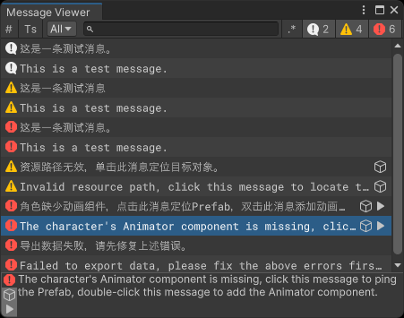

# Editor Messages

在Unity Editor中查看和处理自定义消息的工具。 A tool to view and process custom messages in Unity Editor.

## 功能 Features

消息可以指定类型、时间戳、标签、内容、上下文和自定义数据。 Messages can specify type, timestamp, label, content, context, and custom data.

消息查看器中可以切换显示行号、时间戳，按类型、文本筛选消息，支持正则表达式筛选。 The message viewer can switch to display line numbers, timestamps, filter messages by type and text, and support regular expression filtering.

点击消息时，可以查看完整消息内容，若上下文对象是Unity Object，可以定位上下文对象；双击消息时，可以执行自定义的数据处理流程。 Messages can have context objects and custom data. Clicking a message will show the full message content, and if the context object is a Unity Object, it will locate the context object. Double-clicking a message will execute the custom data processing flow.

附带一个可以嵌入到其他窗口的横幅组件，在双击时可以打开消息查看器窗口。 It also has a banner component that can be embedded into other windows. It opens the message viewer window when double clicked.

横幅组件可以选择显示消息列表的最后一条消息，或循环显示消息列表中的消息。 The banner component can choose to display the last message in the message list or loop through the messages in the message list.

## 支持的Unity版本 Supported Unity Versions

Unity 2022.3及更新版本。 Unity 2022.3 or higher.

## 安装方式 Installation

使用 [OpenUPM](https://openupm.com/packages/com.greenbamboogames.editormessages) 安装此包，或者直接克隆此仓库到项目中。 Install this package via [OpenUPM](https://openupm.com/packages/com.greenbamboogames.editormessages), or clone this repository directly into the Packages folder of your project.

## 如何使用 How to Use

使用类型 `Message` 构建消息对象。 Use type `Message` to build message objects.

使用 `MessageViewer.Open()` 方法打开消息查看器窗口。参数用途请查看方法注释。 Use `MessageViewer.Open()` to open the message viewer window. For parameter usage, please refer to the method comments.

使用类型 `MessageBanner` 构建可以嵌入到其他窗口的横幅组件。参数用途请查看方法注释。 Use type `MessageBanner` to build a banner component that can be embedded into other windows. For parameter usage, please refer to the method comments.
